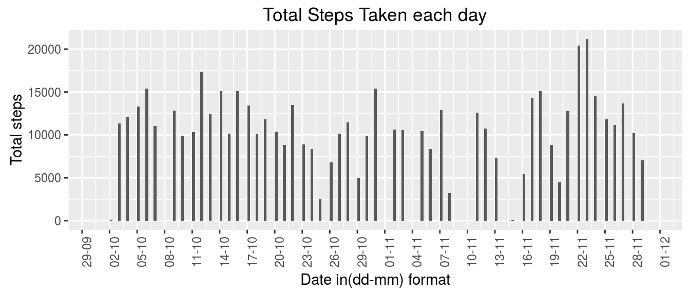
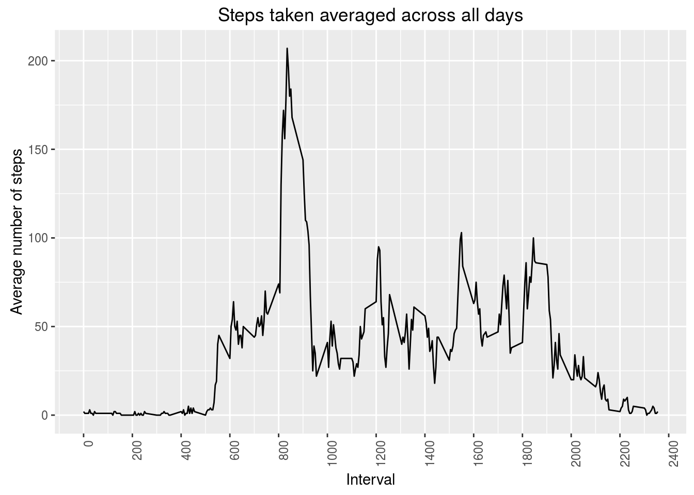
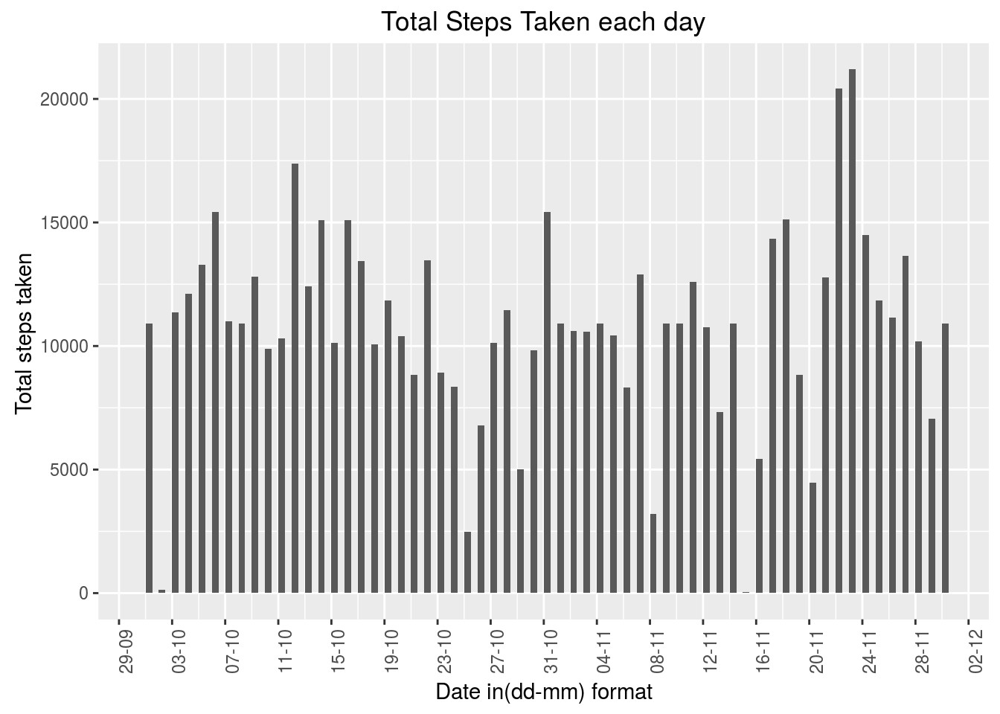
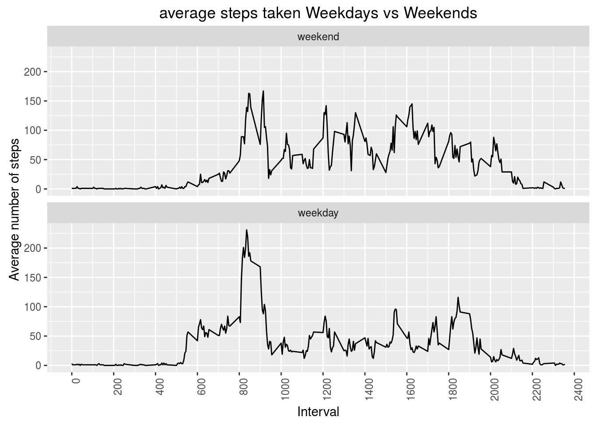

#Load required packages

```r
setwd("~/Documents/RData/Reproducible Research/RepData_PeerAssessment1")
library(plyr)
library(dplyr)
library(data.table)
library(ggplot2)
library(scales)
```

The code below assumes that the **activity.zip** has been extracted in the current working directory.

1. Load the data and convert the date values to appropriate date data type

```r
rawdata <- read.csv("./activity.csv", header = TRUE, sep = ",", stringsAsFactors = FALSE)
rawdata$date <- as.Date(rawdata$date, format="%Y-%m-%d")
```
2. Histogram of the total number of steps taken each day- find in figure/plot1.png

```r
by_date <- group_by(rawdata, date)
p <- ggplot(by_date, aes(date))
p <- p + geom_histogram(aes(weight = steps), binwidth = 0.3)
p <- p + scale_x_date(labels=date_format("%d-%m"), breaks=date_breaks("3 day"))
p <- p + labs(title="Total Steps Taken each day", x="Date in(dd-mm) format", y="Total steps")
p <- p +  theme(axis.text.x = element_text(angle = 90, hjust = 1))
print(p)
```



```r
ggsave("plot1.png", path="./figure", width = 4, height = 4)
```
3. Mean and median number of steps taken each day **NAs have been excluded to avoid NaN**
Dataframe **by_dateNotNull** contains the mean and median number of steps by date

```r
# filter all non NA values from the group by_date
by_dateNotNull <- filter(by_date, !is.na(steps))
by_dateNotNull  %>% summarise_each(funs(mean(., na.rm = TRUE), median(., na.rm=TRUE)), 1)
```

```
## Source: local data frame [53 x 3]
## 
##          date     mean median
##        (date)    (dbl)  (dbl)
## 1  2012-10-02  0.43750      0
## 2  2012-10-03 39.41667      0
## 3  2012-10-04 42.06944      0
## 4  2012-10-05 46.15972      0
## 5  2012-10-06 53.54167      0
## 6  2012-10-07 38.24653      0
## 7  2012-10-09 44.48264      0
## 8  2012-10-10 34.37500      0
## 9  2012-10-11 35.77778      0
## 10 2012-10-12 60.35417      0
## ..        ...      ...    ...
```

```r
head(by_dateNotNull)
```

```
## Source: local data frame [6 x 3]
## Groups: date [1]
## 
##   steps       date interval
##   (int)     (date)    (int)
## 1     0 2012-10-02        0
## 2     0 2012-10-02        5
## 3     0 2012-10-02       10
## 4     0 2012-10-02       15
## 5     0 2012-10-02       20
## 6     0 2012-10-02       25
```
4. Time series plot of average number of steps taken, please see figure/plot2.png 


```r
# grouping rawdata by interval
by_interval <- group_by(rawdata, interval)
# calculate ceiling of the mean to impute NA values
mean_by_interval <- summarise_each(by_interval,funs(ceiling(mean(., na.rm = TRUE))), 1)

#time series plot of average number of steps taken across all days
number_ticks <- function(n) {function(limits) pretty(limits, n)}
ggplot(aes(x = interval, y = steps), data = mean_by_interval) + geom_line() + scale_x_continuous(breaks= number_ticks(10)) + labs(title="Steps taken averaged across all days", x="Interval", y="Average number of steps") + theme(axis.text.x = element_text(angle = 90, hjust = 1))
```



```r
#last_plot()
ggsave("plot2.png", path="./figure", width = 4, height = 4)
```
5. Five minute interval on average across all days, that contains maximum number of steps is **835**

```r
#change the datatype of steps variable from numeric to integer
mean_by_interval$steps <- as.integer(mean_by_interval$steps)
#interval that contains the maximum number of steps
maximumsteps <- mean_by_interval[which.max(mean_by_interval$steps),1]
maximumsteps
```

```
## Source: local data frame [1 x 1]
## 
##   interval
##      (int)
## 1      835
```
6. Mean of the interval across all days has been used to impute NAs, since mean results in floating point values ceiling function has been used to round values

```r
#convert dataframes - containing rawdata(with null values) and means by interval - to data tables
dtmean <- data.table(mean_by_interval, key=c("interval"))
dtrawdata <- data.table(rawdata, key = c("interval"))
#use dataframes to fill in missing values
#followed stackoverflow question below
# http://stackoverflow.com/questions/8349909/creating-a-function-to-replace-nas-from-one-data-frame-with-values-from-another

filledData <- dtrawdata[dtmean]
filledData[is.na(steps), steps := i.steps]
filledData[, i.steps := NULL]
```
7. Calculate total number of missing values- Total number of missing values are 2304

```r
# calculate and report the total number of missing values
sum(is.na(rawdata$steps))
```

```
## [1] 2304
```
8. Histogram of the data after missing values have been filled in


```r
by_date <- group_by(filledData, date)
# Histogram of total steps taken each day
p <- ggplot(by_date, aes(date))
p <- p + geom_histogram(aes(weight = steps), binwidth = 0.5)
p <- p + scale_x_date(labels=date_format("%d-%m"), breaks=date_breaks("4 day"))
p <- p + labs(title="Total Steps Taken each day", x="Date in(dd-mm) format", y="Total steps taken ")
p <- p + theme(axis.text.x = element_text(angle = 90, hjust = 1))
p
```



```r
#last_plot()
ggsave("plot3.png", path="./figure", width = 4, height = 4)
```
9. Mean and median of Data after imputing NAs. Both mean and median have changed after imputing missing values and  differ from the values in part 1 of assignment.

```r
result <- by_date  %>% summarise_each(funs(mean(.), median(.)), 1)
result
```

```
## Source: local data table [61 x 3]
## 
##          date     mean median
##        (date)    (dbl)  (dbl)
## 1  2012-10-01 37.87847   34.5
## 2  2012-10-02  0.43750    0.0
## 3  2012-10-03 39.41667    0.0
## 4  2012-10-04 42.06944    0.0
## 5  2012-10-05 46.15972    0.0
## 6  2012-10-06 53.54167    0.0
## 7  2012-10-07 38.24653    0.0
## 8  2012-10-08 37.87847   34.5
## 9  2012-10-09 44.48264    0.0
## 10 2012-10-10 34.37500    0.0
## ..        ...      ...    ...
```
10. Panel plot comparing average number of steps taken per 5 minute interval weekdays vs weekends


```r
# http://stackoverflow.com/questions/28893193/creating-factor-variables-weekend-and-weekday-from-date
#create a vector of weekdays
weekdays <- c('Monday', 'Tuesday', 'Wednesday', 'Thursday', 'Friday')
#Use `%in%` and `weekdays` to create a logical vector
#convert to `factor` and specify the `levels/labels`
filledData$day <- factor((weekdays(filledData$date) %in% weekdays), levels=c(FALSE, TRUE), labels=c('weekend', 'weekday') )
# grouping filledData by interval
by_interval <- group_by(filledData, interval, day)
# mean across all days
mean_by_interval <- summarise_each(by_interval,funs(ceiling(mean(.))), 1)

#time series plot of average number of steps taken across all days
number_ticks <- function(n) {function(limits) pretty(limits, n)}
ggplot(aes(x = interval, y = steps), data = mean_by_interval) + geom_line() + scale_x_continuous(breaks= number_ticks(10)) + facet_wrap(~day, scales="fixed", nrow = 2) +
  labs(title="average steps taken Weekdays vs Weekends", x="Interval", y="Average number of steps") + theme(axis.text.x = element_text(angle = 90, hjust = 1))
```



```r
#last_plot()
ggsave("plot4.png", path="./figure", width = 4, height = 4)
```

